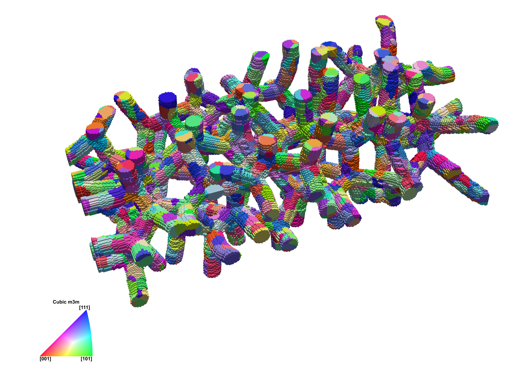

Establish Foam Morphology {#establishfoammorphology}
=====

## Group (Subgroup) ##
Synthetic Builder Filters (Packing)

## Description ##
This filter functions similar to **Pack Primary Phases** at the onset.  The working **Phase Type** for this filter is the **Precipitate Phase**.  The **Precipitate Phase** represents the pores.  The pores are packed on to the grid and grown until they impinge.  Then, designated voxels on and/or near triple junctions and quadruple points, defined my the **Minumum Strut Thicknes**, **Strut Thickness Variability Factor**, and **Strut Cross Section Shape Factor**, are flipped back to **BadData**, i.e. **FeatureIds** = 0 and the **Mask** is defined as true at these voxels, thus forming the strut network.  This filter works in tandem with **Pack Primary Phases**; if the user wishes to pack a feature population within the **Mask**.  The **Mask** represents the voxels where the struts exist. For an extended treatment of the algorithm please see [1]

## Parameters ##
| Name | Type | Description |
|------|------| ----------- |
| Periodic Boundaries | bool | Whether to *wrap* **Features** to create *periodic boundary conditions* |
| Write Goal Attributes | bool | Whether the user wants the goal attributes of the generated **Features** to be written to a file |
| Goal Attributes CSV File | File Path | Path to the file that will hold the goal attributes of the generated **Features** (only necessary if *Write Goal Attributes* is *true*) |
| Already Have Features | choice | Whether the user already has the final **Cell** definition of the **Features** and can skip the **Feature** generation and iterative placement process |
| Minimum Strut Thickness | int | Minimum strut thickness (in user defined scaled units, e.g. microns).  No strut will have a ciricular cross-sectional diameter less than this value. |
| Strut Thickness Variability Factor | float | This quantity is the triple junction Euclidean distance multiplied by the quadruple point Euclidean distance (in user defined scaled units, e.g. microns^2).  This parameter will make the struts thicker towards the node with increasing values. |
| Strut Cross Section Shape Factor | float | This quantity is the triple junction Euclidean distance multiplied by the boundary Euclidean distance (in user defined scaled units, e.g. microns^2).  This parameter will make the strut cross section more "triangular" with decreasing values. |

## Required Geometry ##

Image

## Required Objects ##

| Kind | Default Name | Type | Component Dimensions | Description |
|------|--------------|------|----------------------|-------------|
| **Ensemble Attribute Array** | Statistics | Statistics Object | (1) | Statistics objects (depending on *Phase Type*) that store fits to descriptors such as size distribution, shape distribution, neighbor distribution, ODF, MDF, etc. |
| **Ensemble Attribute Array** | PhaseTypes | uint32_t | (1) | Enumeration specifying the phase type of each **Ensemble** |
| **Ensemble Attribute Array** | PhaseNames | uint32_t | (1) | Enumeration specifying the phase type of each **Ensemble** |
| **Ensemble Attribute Array** | ShapeTypes | uint32_t | (1) | Enumeration specifying the type of shape to place for each **Ensemble** |
| **Cell Attribute Array** | FeatureIds | int32_t | (1) | Specifies to which **Feature** each **Cell** belongs.  This is only required if the **Already Have Features** choice is "Yes". |

## Created Objects ##

| Kind | Default Name | Type | Component Dimensions | Description |
|------|--------------|------|----------------------|-------------|
| **Cell Attribute Array** | FeatureIds | int32_t | (1) | Specifies to which **Feature** each **Cell** belongs.  This is only created if the **Already Have Features** choice is "No".  |
| **Cell Attribute Array** | Mask | bool | (1) | Specifies if **GoodData** (true) or **BadData** (false) is on each **Cell** |
| **Cell Attribute Array**     | Phases            | int32_t | (1) | Specifies to which **Ensemble** each **Cell** belongs |
| **Attribute Matrix** | CellEnsembleData | Cell Ensemble | N/A | **Ensemble Attribute Matrix** for the created phases |
| **Ensemble Attribute Array** | NumFeatures | int32_t | (1) |  Specifies the number of **Features** in each **Ensemble** |

## Published Paper ##

	[1] *Tucker, J.C. & Spear, A.D. Integr Mater Manuf Innov (2019) 8: 247. https://doi.org/10.1007/s40192-019-00136-5
    *Corresponding author.

## License & Copyright ##

Please see the description file distributed with this **Plugin**

    This material is based upon work supported by the National Science Foundation under Grant No. 1629660.  Any opinions, findings, and conclusions or recommendations expressed in this material are those of the author(s) and do not necessarily reflect the views of the National Science Foundation.**

